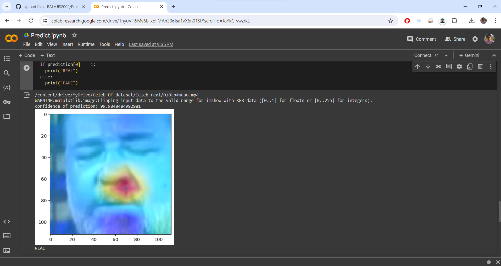
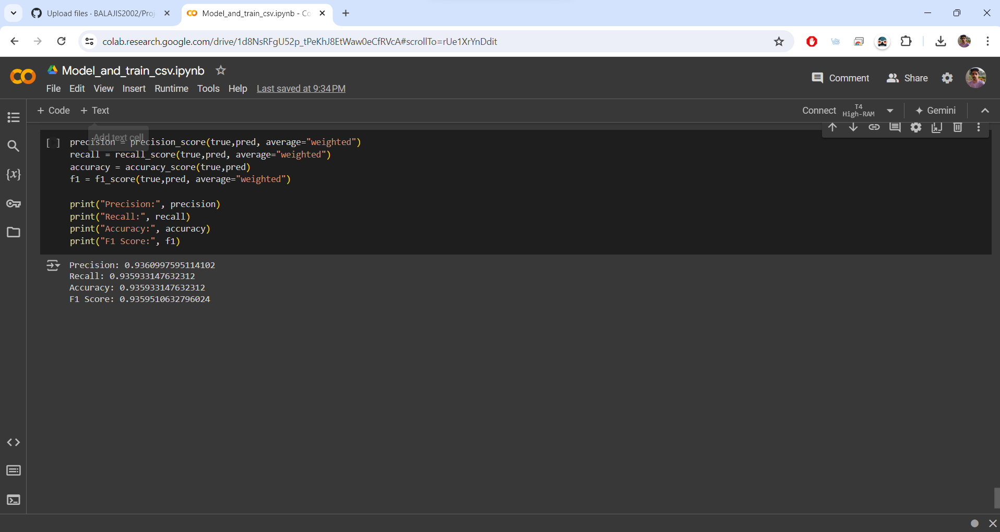
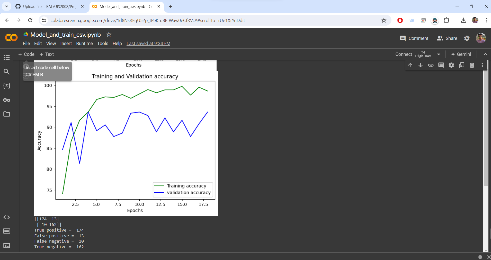
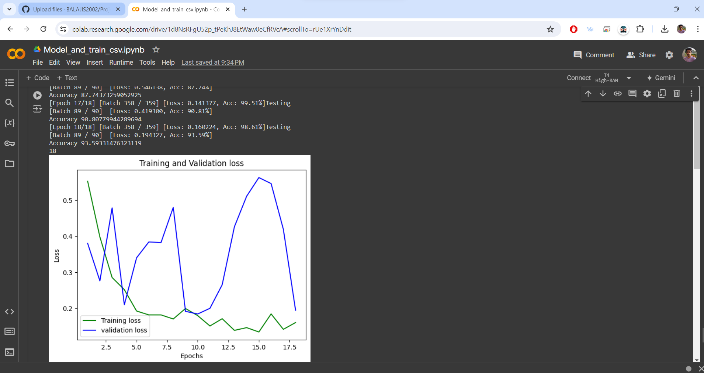
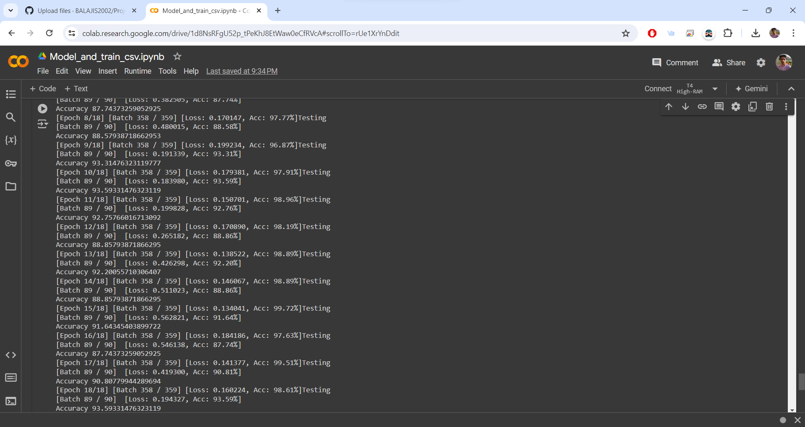
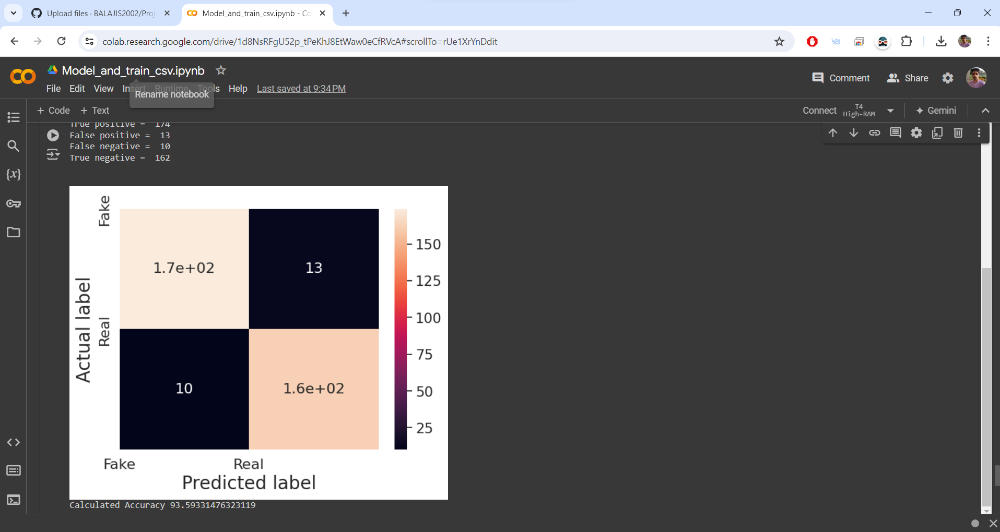

## Introduction and Outputs
A deepfake detection system using ResNeXt and Long Short-Term Memory (LSTM) networks offers a 
robust solution by combining advanced spatial feature extraction and temporal sequence analysis.
This approach leverages ResNeXt's modular and efficient architecture for high-quality feature 
representation and LSTM's capability to capture temporal dependencies, resulting in improved
detection accuracy and robustness compared to previous models. By focusing on facial regions
and analyzing temporal inconsistencies across frames, the system effectively distinguishes
genuine videos from manipulated ones, addressing critical security and trust concerns in digital media.

## Sample Outputs

Prediction:

Accuracy and Performance Metrics:

